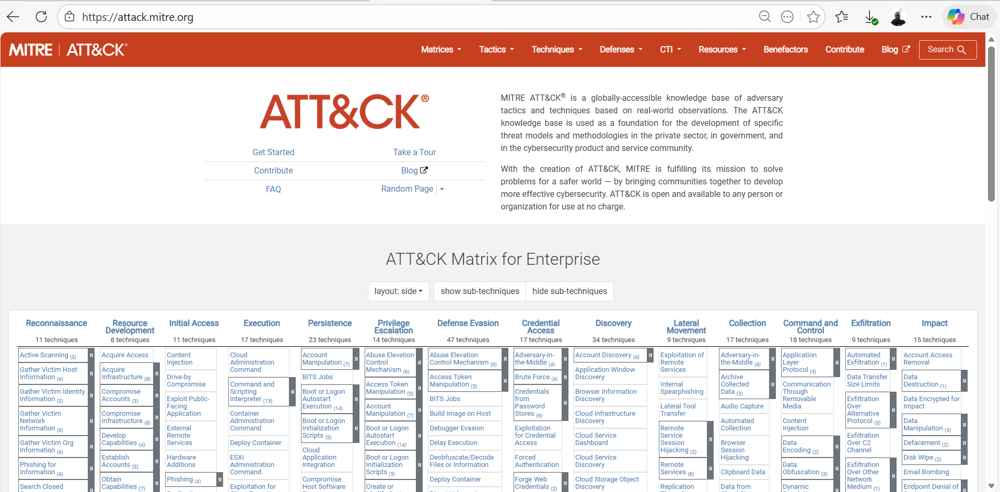
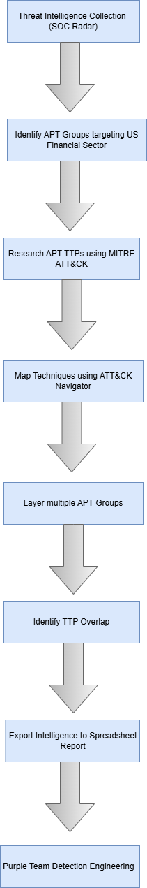
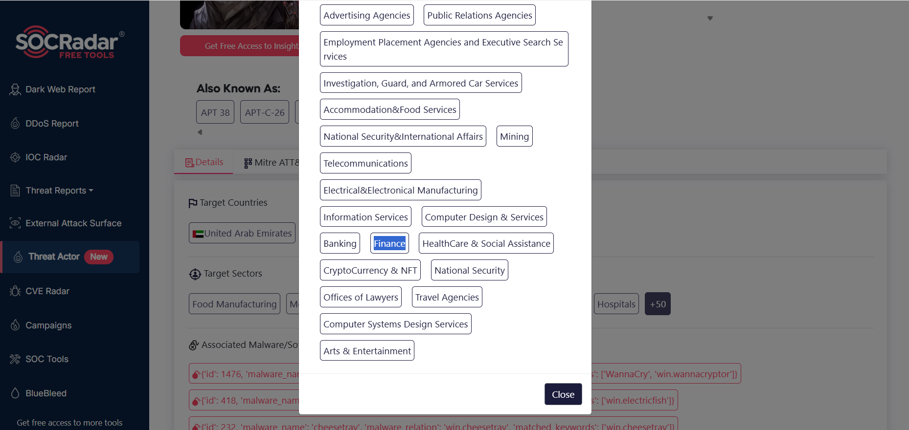
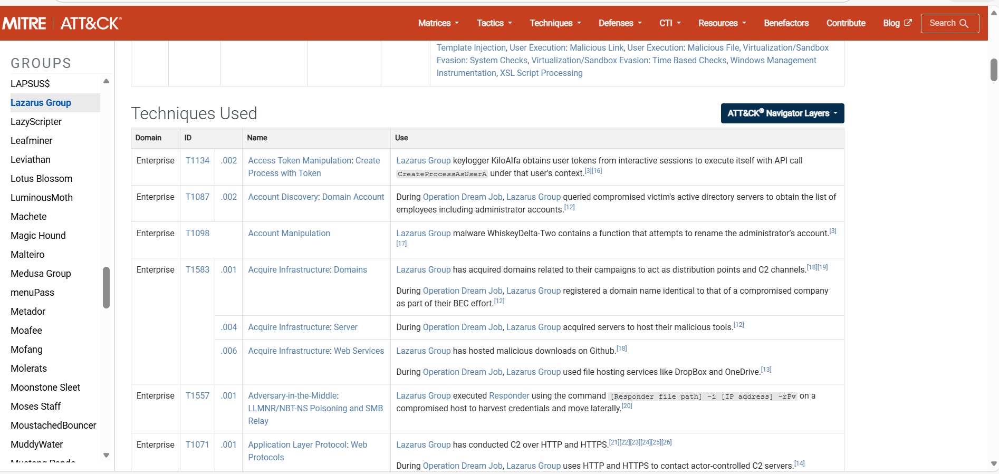
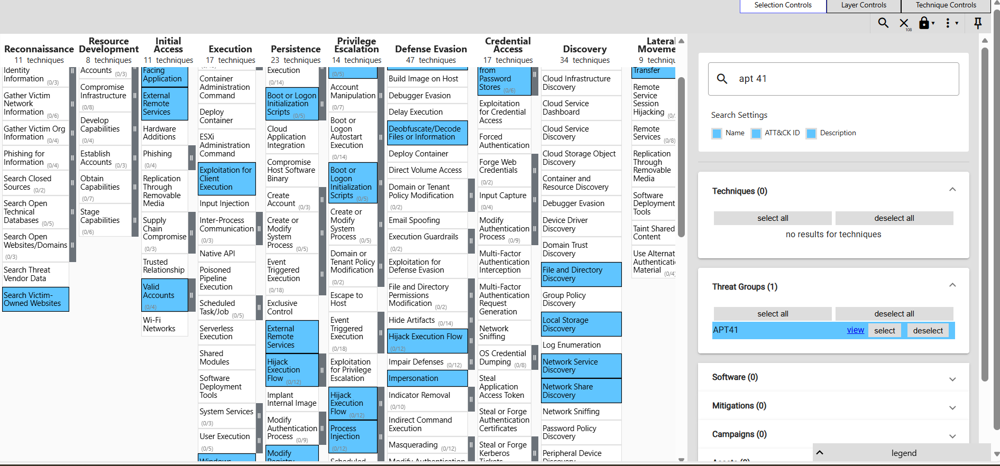
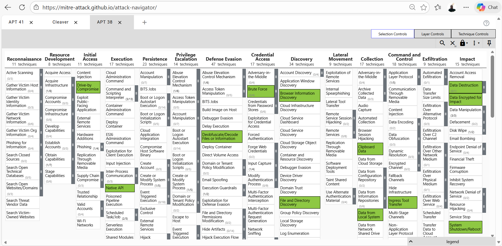
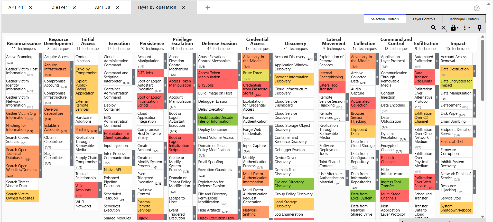
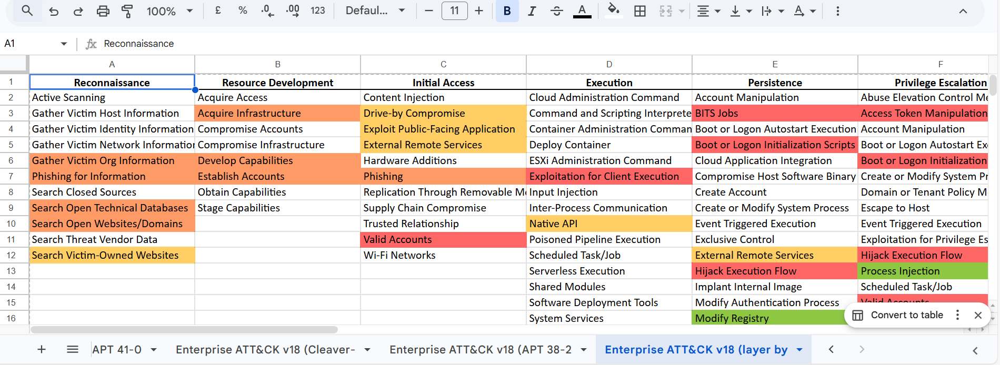

# Threat Hunting Using MITRE ATT&CK Framework

## Project Overview

This project explores a threat hunting methodology using the MITRE ATT&CK framework to analyze adversary behavior through their Tactics, Techniques, and Procedures (TTPs).

For the purpose of this project, the United States financial sector was used as a case study to research Advanced Persistent Threat (APT) groups and analyze the techniques they are known to use.

The goal was to understand how threat intelligence can be gathered, analyzed, and mapped to the MITRE ATT&CK framework in order to support threat hunting and detection engineering activities.

#### Skills Demonstrated

- Threat Intelligence Analysis
 
- MITRE ATT&CK Framework

- Threat Actors TTP Analysis

- MITRE ATT&CK Navigator

- Threat Hunting Methodology

- Detection Engineering Concepts

## Understanding the MITRE ATT&CK Framework

The MITRE ATT&CK framework is a knowledge base that documents how adversaries behave during cyber attacks.

It organizes adversary behavior into three important concepts:

#### Tactics

Tactics represent the high-level goals attackers attempt to achieve during an intrusion. The framework currently defines 14 tactics across the attack lifecycle.

#### Techniques
Techniques describe how attackers achieve those goals.

#### Procedures
Procedures are the specific implementations used by threat actors to execute those techniques.

Together, these form the well-known concept of TTPs (Tactics, Techniques, and Procedures) used in threat intelligence and threat hunting.

## Threat Hunting Workflow

## Threat Intelligence Collection

Threat intelligence was gathered using SOC Radar to research APT groups associated with this Sector (Finance) of this region (United States of America)

Although APT groups often operate across multiple industries and geographic regions, this project narrows the scope to the U.S. financial sector as a case study to demonstrate how threat intelligence research and TTP analysis can be conducted.

#### Additional information about identified threat actors was gathered from:

- SOC Radar threat intelligence reports
- MITRE ATT&CK threat actor profiles
- Publicly documented adversary techniques
  

## TTP Research Using MITRE ATT&CK

Once relevant APT groups were identified, their documented TTPs were analyzed using the MITRE ATT&CK website.

This step allowed the techniques used by each threat group to be examined in relation to the attack lifecycle, providing insight into how adversaries operate during real-world attacks.

## Mapping Techniques Using MITRE ATT&CK Navigator

The identified techniques were then mapped using MITRE ATT&CK Navigator.

MITRE Navigator provides a visual way to:
- map adversary techniques
- analyze attacker behavior
- compare multiple threat actors
  

Each threat group was mapped as a separate layer in the Navigator.

## Layering Multiple Threat Groups

Multiple APT groups were added as layers within the MITRE Navigator matrix.

This allows analysts to compare different threat actors and observe how their techniques relate to each other.

Layering adversaries makes it easier to identify patterns of behavior across different threat groups.

## Identifying TTP Overlap

By layering multiple adversaries, it becomes possible to identify overlapping techniques.

These overlapping techniques often represent common attacker behaviors, which are particularly valuable for defenders because detecting them can help identify multiple threat actors.

## Intelligence Reporting

The mapped techniques were exported to a spreadsheet report to organize the findings.

This report documents:
- The APT groups analyzed
- Their associated techniques
- Overlapping techniques observed across adversaries

## Supporting Detection Engineering

The final report can be used by security and purple teams to develop detection strategies such as:
- SIEM detection rules
- Threat hunting queries
- Behavioral alerts based on ATT&CK techniques
  

Understanding adversary techniques allows security teams to design defenses that are aligned with real attacker behavior.

Author

Richard T. Arowobusoye

Cybersecurity | Threat Hunting | Security Operations
